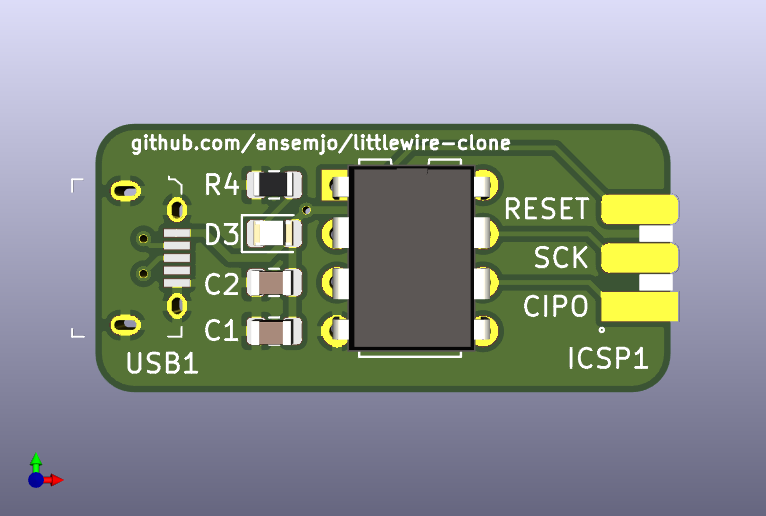
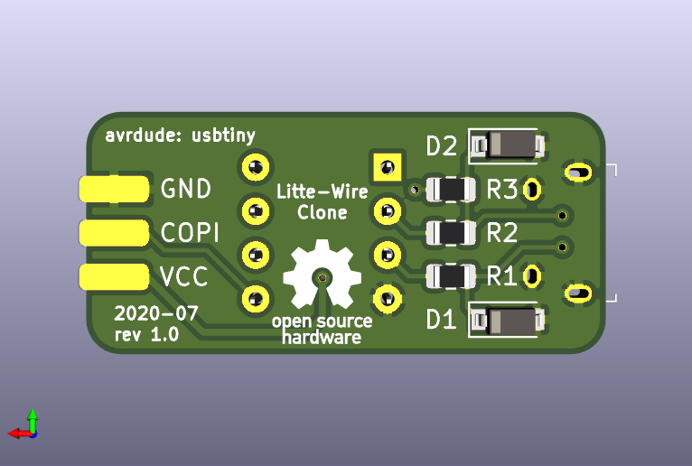
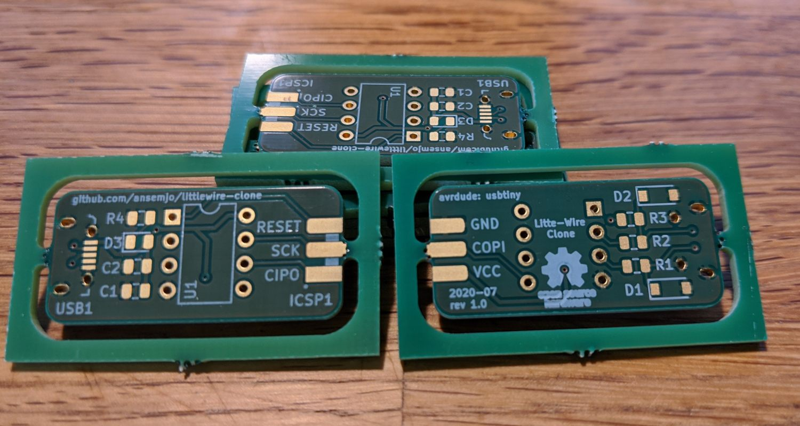

# littlewire-clone

This is a clone of [Little Wire](https://littlewire.github.io/) with
mostly SMD parts.

The special part about it is that it uses a female ICSP header soldered
on the edge of the board, which can be plugged into the target device
directly.

# WORK IN PROGRESS

I have just ordered the first batch thorugh https://aisler.net/. I will
continue documenting software steps once those boards arrive.

**Update 2020-07-15:** the PCBs arrived today :)

