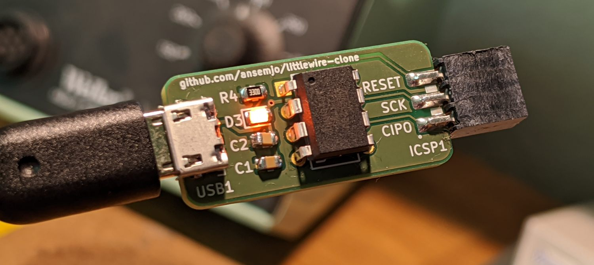

# littlewire-clone

This is a clone of [Little Wire](https://littlewire.github.io/) by Ihsan Kehribar
with mostly SMD parts.

The special part about it is that it uses a female ICSP header soldered
on the edge of the board, which can be plugged into the target device
directly or used with "pogo-pin" adapters like
[the one by Pnoxi](https://www.tindie.com/products/pnoxi/avr-isp-pogo-pin-adapter-2x3-idc2x3-pogo-254mm/).

*Yes, I know my C2 is crooked .. Next time I'll use the "elongated pads" footprint.*

## Project structure

There's a number of interesting subdirectories, in order of applicability:

| Directory | Description |
| --------- | ----------- |
| [`hardware`](hardware/) | The KiCad 5.1.6 project with schematics and manufacturing files for PCB production. |
| [`bootloader`](bootloader/) | Instructions on how to put the `micronucleus` bootloader onto the chip once it's assembled. |
| [`firmware`](firmware/) | A vendored copy of the Little Wire / `usbtiny` source code to install the firmware.

## First batch

I have ordered the first batch thorugh [aisler.net](https://aisler.net/). From those
I have now assembled and tested two boards.

Currently I have **6** circuit boards left. Shoot me a
[message](https://twitter.com/ansemjo) if you want one of those.

