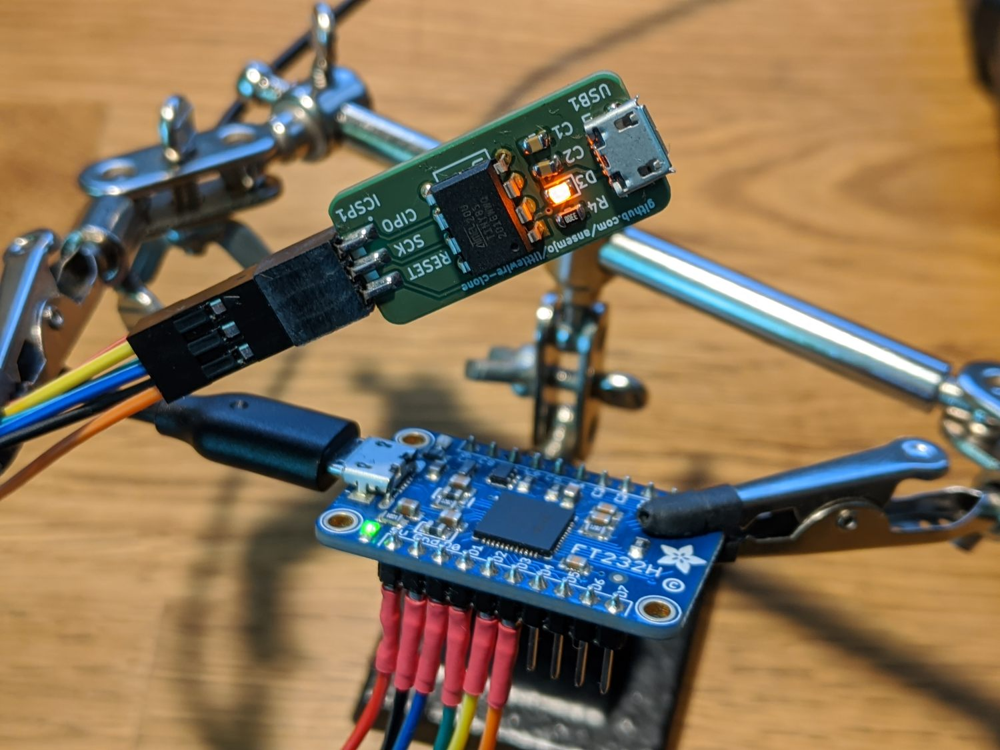
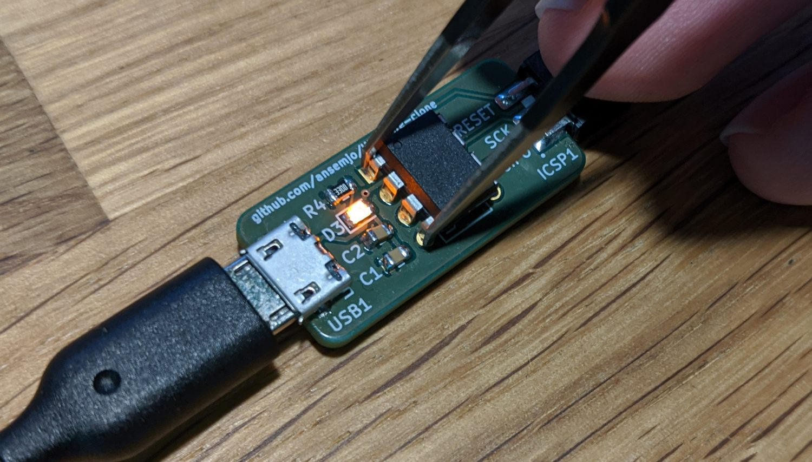

# Flashing the `micronucleus` bootloader

The `micronucleus` project is a bootloader that uses the same V-USB stack by
Objective Development that the `usbtiny` firmware uses. This is convenient
because once everthing is soldered in place you ideally do not want to attach
testclips or anything like that to program your ATtiny over ISP every time.
Also, since we need to ultimately disable the Reset pin in order to use it as
an additional IO pin, we won't be able to program it without a high-voltage
programmer anyway.

Briefly, the steps are:

* Flash a default micronucleus configuration and set the required fuses to see
  if the stack works and you can program the ATtiny over USB
* Flash the slightly customized `t85_littlewire` configuration
* Disable the external Reset pin with a fuse setting
* Continue programming the actual firmware over USB

## Obtain the `micronucleus` source code

You can checkout the submodule in `./micronucleus` or download an extract an
archive from GitHub yourself:

    git submodule update --init micronucleus/

Now enter the subdirectory `firmware/` of micronuleus for all following commands:

    cd micronucleus/firmware/

## Flash the default `t85_default` configuration

The pinout on the `littlewire` is compatible with the default configuration for the
ATtiny85. Therefore just use the `t85_default` configuration at first. Build the
firmware, flash it and set the fuses for the correct clock settings etc.

You'll need an ISP programmer for this but you can use any existing programmer with
a couple of jumper wires. The ICSP pins of the ATtiny are conveniently laid out for
you. :P

    make CONFIG=t85_default PROGRAMMER="-c ft232h" flash
    make CONFIG=t85_default PROGRAMMER="-c ft232h" fuse

Substitute the `PROGRAMMER` variable according to the one you're using. I have an
alias in my `~/.avrduderc` for an FTDI FT232H based one here.

## Check if the bootloader is working

Connect a USB cable and check if the device is recognized. On Windows you'll likely
need some drivers first. Try erasing the chip through the bootloader:

    micronucleus --erase-only

## Flash the custom `t85_littlewire` configuration and disable Reset pin

Everything OK? Good. Now we need to disable the Reset pin.

However, there still needs to be a way to enter the bootloader when the `littlewire`
firmware is flashed. By default, `micronucleus` *always* starts and then chainloads
the actual firmware after something like 6 seconds. Meh.

With a little change to the `#define ENTRYMODE ..` we can use a jumper pin, that needs
to be pulled low on power-up to enter the bootloader. I think using the Reset pin `PB5`
is fitting here.

Modify the default config or just link / copy the prepared configuration in `t85_littlewire`:

    ln -sr ../../t85_littlewire configuration/

And repeat the `flash` command above with the new config:

    make CONFIG=t85_littlewire PROGRAMMER="-c ft232h" flash

As long as there is no actual firmware on the ATtiny85 it will always enter the
`micronucleus` bootloader unconditionally. To make the Reset pin available, finally
set the high fuse to disable it:

    make CONFIG=t85_littlewire PROGRAMMER="-c ft232h" disablereset

**After this command you won't be able to program the chip over ISP anymore.** That's why
you should make sure that the bootloader works first.

Now continue with the firmware. If you need to enter the bootloader later, either use a
two-pin jumper in the female ICSP header or use tweezers to short pins 1 and 4 before
connecting the USB cable:

