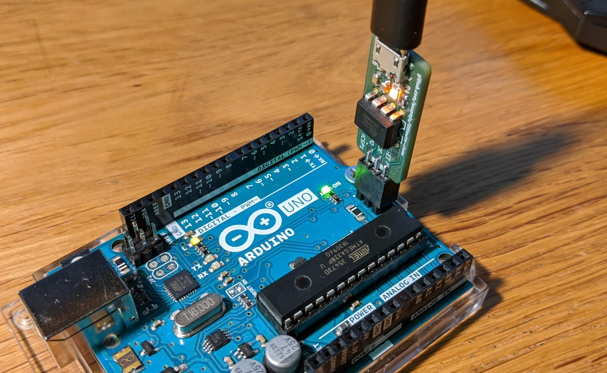

# LittleWire Firmware

This is the `firmware/` subdirectory from Ihsan Kehribar's project at
[github.com/littlewire/Little-Wire](https://github.com/littlewire/Little-Wire).

It is simply downloaded from commit [d918a4b](https://github.com/littlewire/Little-Wire/commit/d918a4ba1ccae27ef02997fd5512054f45110619)
and vendored in full. No files were modified by me.

For more information and compatible software libraries checkout his page
at [littlewire.github.io](https://littlewire.github.io/)!

## Flashing

Have you completed the steps to flash and test the `micronucleus` bootloader
in [../bootloader](../bootloader/README.md)?

Compile the firmware file `main.hex` and use the `micronucleus` commandline
to flash it over USB:

    make hex
    micronucleus main.hex

Done!

## Using with `avrdude`

It is written on the circuit board silkscreen so you can never forget the
programmer option: it is `usbtiny`.

On the top side there are two small patches of white silkscreen between the
ICSP header pins. That is representing the "notch" on 6-pin ICSP cables. Here
you can see me flashing an Arduino Uno:

    avrdude -c usbtiny -p m328p -U blink.hex

## Note on `udev` rules

On Linux you'll either need to use `sudo ..` for your commands or add a
ruleset to `udev` to allow accessing Little-Wire's USB port. The following
snippet assumes that your user is member of the `plugdev` group and shall be
placed in `/etc/udev/rules.d/49-usbtiny-programmer.rules` for example:

    # allow writing to usbtiny programmers
    SUBSYSTEMS=="usb", ATTRS{idVendor}=="1781", ATTRS{idProduct}=="0c9f", MODE:="0660", GROUP="plugdev"
